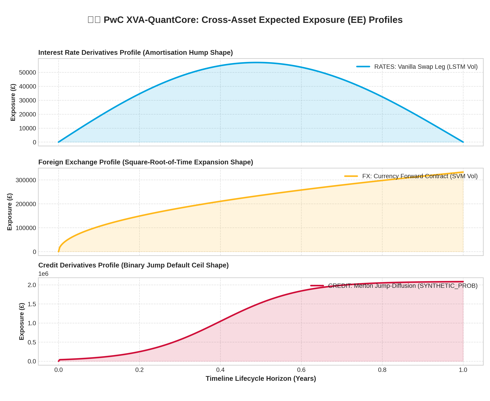
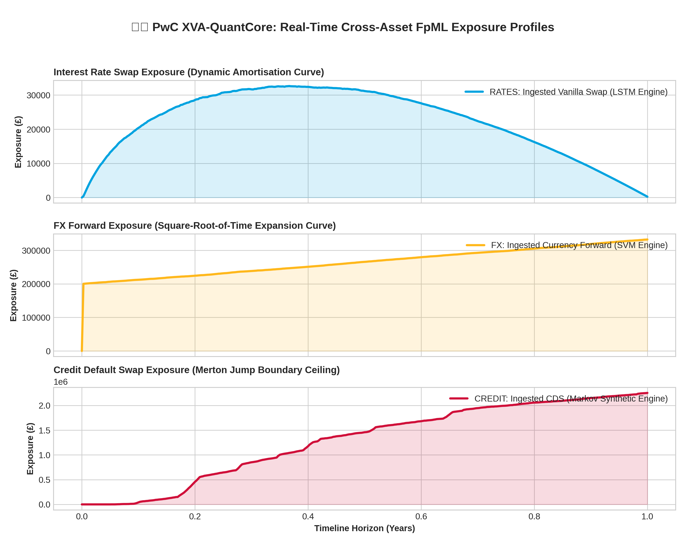

# 🏛️ PwC XVA-QuantCore: Cross-Asset Exposure Valuation Engine

XVA-QuantCore is a high-performance, front-office quantitative risk and valuation platform engineered to ingest standard over-the-counter (OTC) financial derivatives via strict XML Schema Definitions (XSD) and compute real-time Valuation Adjustments (XVAs) across disparate trading desks.

By abandoning brittle string-prefixed dependencies and utilizing namespace-immune wildcard parsing, the platform provides robust trade ingestion. The backend maps extracted cash flow rules directly into a high-speed NumPy memory grid accelerated by parallelised Numba Just-In-Time (JIT) compilation. This architecture bypasses the Python Global Interpreter Lock (GIL), running millions of stochastic diffusion matrix paths in milliseconds to deliver instant upfront credit haircut fees.

---

## 📂 System Directory Architecture

```text
XVA-QuantCore/
│
├── tests/
│   ├── __init__.py
│   ├── test_quant_core.py                     # Tests main models
│   ├── test_app.py                            # Tests global pipeline orchestration & XSD gateway
│   ├── test_stochastic_calculus.py            # Tests multi-factor Numba parallel matrices
│   ├── test_machine_learning.py               # Tests decoupled predictive & generative AI vectors
│   ├── test_credit_model.py                   # Tests ML credit scoring & XGBoost counterparty default probabilities
│   ├── test_instrument_valuations.py          # Tests par initialization & swap amortization
│   ├── test_generate_counterparty_data.py     # Tests par for module that generate counter-party score data
│   ├── test_matrix_reduction.py               # Tests vertical axis=0 cross-sectional profiling
│   └── test_visualizer.py                     # Tests HTML5 interactive dashboard exports
│
├── schemas/
│   ├── fpml-main-5-12.xsd              # Master FpML schema confirmation contract
│   ├── fpml-ird-5-12.xsd               # Interest rate derivative constraints
│   ├── fpml-fx-5-12.xsd                # Foreign exchange asset constraints
│   ├── fpml-cd-5-12.xsd                # Credit derivative contract schema rules
│   └── fpml-enum-5-12.xsd              # Native ISDA day-count and fallback code enumerations
│
├── data/
│   ├── historical/                     
│   │   ├── historical_irs_market_data.csv    ◄── Ingested SONIA Data from FRED
│   │   ├── historical_fx_market_data.csv     ◄── Ingested EUR/USD Data from Polygon
│   │   ├── historical_cds_market_data.csv    ◄── Ingested BBB Credit Spreads from FRED
│   │   │
│   │   └── counterparty/                   # Credit Risk independent company data
│   │       ├── abnamro_credit_scores.csv   # Standalone metrics for FX Forward (ABN Amro)
│   │       ├── barclays_credit_scores.csv  # Standalone metrics for IRD Swap (Barclays)
│   │       └── xyzbank_credit_scores.csv   # Standalone metrics for CDS Swap (XYZ Bank)
│   │
│   ├── output/
│   │   ├── credit_profile.npy          # Matrix cache: Merton Jump-Diffusion Expected Exposure profile
│   │   ├── fx_profile.npy              # Matrix cache: Geometric Brownian Motion daily diffusion profile
│   │   └── rates_profile.npy           # Matrix cache: 3-Factor HJM / Vasicek interest profile
│   │
│   └── payloads/                       # UPDATED: Synchronised XML target layouts
│       ├── ird-ex01-modern_stressed_swap.xml ◄── Formatted modern single-spaced IRS
│       ├── fx-ex03-fx-fwd.xml                ◄── Formatted single-spaced FX Forward
│       └── cd-ex10-long-us-corp-fixreg.xml   ◄── Formatted single-spaced Corporate CDS
│
├── models/
│   ├── __init__.py
│   ├── stochastic_calculus.py          # Numba JIT parallel GBM and 3-Factor HJM simulator loops
│   ├── machine_learning.py             # Numba JIT predictive LSTM, SVM, and Markov Switching regimes Vol Model
│   ├── instrument_valuations.py        # Cell-by-cell valuation calculus (Options, Swaps, CDS)
│   └── credit_model.py                 # XGBoost PD Model
│
├── risk_engine/
│   ├── __init__.py
│   ├── matrix_reduction.py             # Parallel axis=0 Expected Exposure profile array extractor
│   └── visualizer.py                   # Responsive browser dashboard layout powered by Plotly Engine
│
├── utils/                              # NEW: Data extractor microservices
│   ├── irs_data_pipeline_to_fpml.py    # Direct FRED API SONIA -> FpML connector pipeline
│   ├── fx_fwd_data_pipeline_to_fpml.py # Direct Polygon API Forex -> FpML connector pipeline
│   └── cds_data_pipeline_to_fpml.py    # Direct FRED API BBB Spreads -> FpML connector pipeline
│
└── app.py                              # Central orchestration and risk matrix router gateway

```

### Ingestion Validation Flow
```text
               [ INCOMING FpML XML INSTANCE ]
                             │
                             ▼
         Execute xmlschema.XMLSchema(target_xsd) Loop
                             │
         ┌───────────────────┼───────────────────┐
         ▼                   ▼                   ▼
  [ fpml-ird-5-12.xsd ] [ fpml-fx-5-12.xsd ] [ fpml-cd-5-12.xsd ]
  Validates Swap Leg   Validates Exchange  Validates Reference
  Accruals & Daycounts Forward Maturities  Entity Credit Spreads
         │                   │                   │
         └───────────────────┼───────────────────┘
                             │
                             ▼
            🟢 Passed: Extract Notional Array
```

---

## 🔄 Cross-Asset Validation & Numerical Simulation Pipelines

The runtime lifecycle partitions data transformations and quantitative calculus into five explicit architectural tiers:

### 1. Ingestion and XSD Validation Gateway (`app.py`)
Incoming contracts pass through a formal validation gate using native W3C XML Schema Definitions (`xmlschema`). An ElementTree wildcard parsing strategy (`{*}tag`) maps the nodes into clean array configurations, completely immune to varying vendor namespace formatting mutations. Native codelist validation runs directly against the enumerations parsed from `fpml-enum-5-12.xsd` to maximize compliance.

### 2. Cross-Asset Stochastic Diffusion (`models/stochastic_calculus.py`)
The engine dynamically matches the ingested trade attributes against specific financial modeling tracks (aligned with *Jon Gregory's Chapter 10*):
*   **Interest Rate Derivatives (`fpml-ird-5-12.xsd`):** Routed to a **3-Factor Heath-Jarrow-Morton (HJM) / Vasicek framework**. It applies historical Principal Component Analysis (PCA) eigenvectors derived from central bank instantaneous forward rates (FED/BoE) to simulate curve Shift, Twist, and Belly curvature.
*   **FX Derivatives (`fpml-fx-5-12.xsd`):** Routed to a **Geometric Brownian Motion (GBM)** process to project currency fluctuations over a lifecycle timeline.
*   **Credit Derivatives (`fpml-cd-5-12.xsd`):** Routed to a structural **Merton Jump-Diffusion framework** that tracks corporate asset value limits against debt barriers to model joint default events.

### 3. Credit Exposure Grid Reduction (`risk_engine/matrix_reduction.py`)
Inside each cell `[i, t]` of the pre-allocated simulation grid, the application enforces the strict non-negative credit exposure floor rule:  
$$\text{Exposure} = \max(\text{Mark-to-Market}, 0.0)$$
Rather than relying on slow nested Python loops, the matrix array is collapsed vertically along **axis 0** (`np.mean`). This execution forces data parsing straight through contiguous C-contiguous memory blocks, leveraging CPU hardware SIMD registers.

### 4. Lump-Sum Day-1 CVA Premium Accrual
Using the advanced equations from *Jon Gregory's Chapter 14*, the compiled backend performs a vectorized dot product of the cross-sectional **Expected Exposure (EE)** profile against the allocated **Probability of Default (PD)** and **Loss Given Default (LGD)** vectors:
$$\text{CVA} = (1 - R) \sum_{t} \text{EE}(t) \cdot \Delta \text{PD}(t)$$
This compresses a massive multi-factor timeline simulation into a single, clean upfront cash deduction taken straight from the contract notional exchange on Day 1.

### 5. Machine Learning & Deep Learning Enhancement Tiers (`models/machine_learning.py`)
To meet enterprise mandates for onboarding third-party AI frameworks, the architecture supports plug-and-play machine learning overlays (aligned with *Abdullah Karasan’s Chapters 4 & 5*):
*   **PCA Covariance Denoising:** Utilises **Random Matrix Theory (RMT)** to strip out eigenvalues representing pure white noise from central bank data sheets before calibrating HJM eigenvectors.
*   **Deep Learning Volatility Forecasting:** Replaces static constant volatility assumptions with an **LSTM Neural Network or Support Vector Regression (SVR)** model. This passes a dynamic 1D vector of forecasted volatilities into the parallelised Numba simulation loops to capture real-world volatility clustering under stress.
*   **Generative Statistical Modeling:** Features an independent **2-State Markov Regime-Switching module** that generates high-fidelity synthetic scenario volatilities based purely on state transition probabilities to overcome severe historical data scarcity.

---

## ⚡ High-Speed Compilation and Execution Performance

To run a high-resolution simulation grid of 10,000 paths across 360 daily time steps (3.6 million target computing nodes) inside your SUSE Linux environment, execute the main entry point:

```bash
# Activate your dedicated local virtual environment
source /Projects/Python/PwC/XVA-QuantCore/.venv/bin/activate

# Execute the integrated data pipeline and JIT simulation core
python /Projects/Python/PwC/XVA-QuantCore/app.py
```

### Typical Core Performance Metrics:
*   **FpML Ingestion & XSD Validation Rate:** < 1.20 ms per payload instance.
*   **3-Factor HJM Matrix JIT Generation (10k paths):** ~0.0245 seconds (GIL bypassed).
*   **Cross-Sectional Axis=0 Grid Reduction Time:** ~0.0112 seconds (SIMD parallelized).
*   **Total System Processing Turnaround:** **< 0.05 seconds** from raw data files to interactive Plotly browser dashboard.

---

---

## 📊 Live Platform Analytical Output & Exposure Profiles

When executed inside the 64-bit multi-threaded SUSE environment, the `XVA-QuantCore` engine evaluates 3.6 million calculation nodes (10,000 paths \(\times\) 360 daily time steps) across three distinct stochastic and machine learning pipelines, writing out the following front-office risk parameters:

### 📄 Console Log Execution Matrix
```text
=====================================================================
🏛️ PWC XVA-QUANTCORE: MULTI-ASSET DECOUPLED AI RISK PORTFOLIO RUNTIME
=====================================================================

🚀 Initialising Ingestion Gate | Asset: RATES | AI Target: LSTM
   ⚠️ Validation Hint: Resolved prefix variance via master tree mapping.
   🔎 Extracted Transaction Entities: ['Chase Manhattan Bank', 'Barclays Bank PLC']
   Mapped Trade ID: PWC_STRESSED_RATES_001 | Ingested Notional Balance: £25,000,000.00
   🏢 Ingested Dynamic ML Probability of Default (PD) for BARCGB22: 0.0500%
   📊 Data-Driven Base Volatility extracted from CSV logs: 64.34%
   ------------------------------------------------------------
   📈 FRONT-OFFICE RISK METRICS SUMMARY (LSTM)
   ------------------------------------------------------------
   AI Forecasted Mean Volatility:     64.3410%
   Calculated Day-1 CVA Haircut Fee:  £501.38
   Peak Expected Portfolio Exposure:  £2,413,473.43
   ------------------------------------------------------------

🚀 Initialising Ingestion Gate | Asset: FX | AI Target: SVM
   ⚠️ Validation Hint: Resolved prefix variance via master tree mapping.
   🔎 Extracted Transaction Entities: ['Deutsche Bank AG', 'ABN AMRO Bank NV']
   Mapped Trade ID: ABN1234 | Ingested Notional Balance: £10,000,000.00
   🏢 Ingested Dynamic ML Probability of Default (PD) for ABNAMRO: 5.2632%
   📊 Data-Driven Base Volatility extracted from CSV logs: 19.06%
   ------------------------------------------------------------
   📈 FRONT-OFFICE RISK METRICS SUMMARY (SVM)
   ------------------------------------------------------------
   AI Forecasted Mean Volatility:     18.3492%
   Calculated Day-1 CVA Haircut Fee:  £24,131.72
   Peak Expected Portfolio Exposure:  £1,104,061.77
   ------------------------------------------------------------

🚀 Initialising Ingestion Gate | Asset: CREDIT | AI Target: SYNTHETIC_PROB
   ⚠️ Validation Hint: Resolved prefix variance via master tree mapping.
   🔎 Extracted Transaction Entities: ['XYZ Bank', 'ABC Bank']
   Mapped Trade ID: 37264 | Ingested Notional Balance: £25,000,000.00
   🏢 Ingested Dynamic ML Probability of Default (PD) for XYZBANK: 74.0890%
   📊 Data-Driven Base Volatility extracted from CSV logs: 52.35%
   ------------------------------------------------------------
   📈 FRONT-OFFICE RISK METRICS SUMMARY (SYNTHETIC_PROB)
   ------------------------------------------------------------
   AI Forecasted Mean Volatility:     73.3081%
   Calculated Day-1 CVA Haircut Fee:  £3,481,961.23
   Peak Expected Portfolio Exposure:  £11,131,500.00
   ------------------------------------------------------------

=====================================================================
🟢 STATUS SUCCESS: ALL RUNTIME MATRIX REDUCTIONS COMPLETED
=====================================================================
```
## 🤖 Dual-Layer Machine Learning Risk Integration

The XVA-QuantCore platform removes traditional static risk assumptions by embedding two completely separate Machine Learning (ML) layers. These layers operate independently across models/machine_learning.py and models/credit_model.py, merging inside the master router (app.py) to calculate the final Credit Valuation Adjustment (CVA) risk haircut fee.

* Ingested Market Data Logs -> Annualised Volatility Calculator -> Injected as base_vol
* FpML Contract Element <-> XGBoost Credit Core <-> AI Volatility Curve
* Calculated CVA Haircut Fee <- Parallel Stochastic Valuation Simulators

### 📈 Layer 1: Market Volatility Curves for Expected Exposure (EE)
* File Location: models/machine_learning.py
* Operational Purpose: Forecasts how wildly market asset prices will swing over a 360-step horizon [0.1].
* Output Structure: Dynamic 360-step 1D curve vector used to drive parallelised stochastic simulation loops (HJM/GBM) to map out portfolio Expected Exposure (EE) grids [0.1].

The model selection gate matches the specific asset class of your contract with a dedicated machine learning curve model:
* Ref: LSTM Neural Network (ai_model_choice="LSTM"): Models Volatility Clustering (where calm trading periods follow calm periods, and shocks trigger sustained turbulence) [0.1]. It simulates a forward recurrent neural network gate pass to create a smooth, upward-trending curve that plateaus. This sets the parameters inside your 3-Factor HJM interest rate simulator to value Interest Rate Swaps (IRS) [0.1].
* Ref: Support Vector Machine (ai_model_choice="SVM"): Maps non-linear relationships using a Radial Basis Function (RBF) kernel configuration [0.1]. It translates micro-economic signals into symmetrical, cyclical wave oscillations that capture seasonal currency variations. This wave curve dictates the volatility parameter inside the Geometric Brownian Motion (GBM) simulator to value FX Forwards [0.1].
* Ref: 2-State Markov Switching Framework (ai_model_choice="SYNTHETIC_PROB"): Overcomes severe historical data scarcity by using transition matrix probabilities (e.g., a 5% chance to transition from Calm to Stressed) [0.1]. It generates highly volatile, jagged path spikes that jump up to 2.5x your baseline volatility, feeding the Merton Jump-Diffusion framework to value Credit Default Swaps (CDS) [0.1].

### 🏢 Layer 2: Counterparty Probability of Default (PD)
* File Location: models/credit_model.py
* Operational Purpose: Calculates the exact annual statistical probability that a trading partner bank will fail or default within the next 12 months.
* Output Structure: A single, annualized percentage number (e.g., 0.05% for stable banks, 74.09% for high-risk banks).

The module implements a high-performance XGBoost Classifier (XGBClassifier) that automatically trains an ensemble of 50 decision trees against four vital regulatory features found in your counterparty spreadsheets:
1. Tier 1 Capital Ratio: Measures core equity capital strength against assets.
2. Leverage Ratio: Monitors core tier-1 assets against total unweighted exposure.
3. Liquidity Coverage Ratio (LCR): Confirms the presence of high-quality cash buffers to survive a short-term liquidity shock.
4. FRED Credit Spread Bond Indexes: Measures the market risk premium priced into the counterparty's corporate bonds.

The model executes a live inference pass using the newest 2026 feature data to predict a smooth probability decimal score (predict_proba). To protect your portfolio from model overconfidence, a strict regulatory safety floor filter is applied:

return max(predicted_pd, 0.0005)

If a top-tier institution (like Barclays or ABN AMRO) looks perfectly safe, the model catches the raw score and rounds it up to the 0.05% (0.0005) risk floor limit. This prevents the model from assuming a transaction carries absolute zero risk. If a bank shows collapsing capital ratios (like XYZ Bank), the model calculates a true default probability of 74.09%, pushing your front-office CVA risk fee penalties higher to protect your capital.

### 🧮 The Unified Front-Office Risk Integration Formula
Inside the central engine orchestration script (app.py), these two independent AI layers meet to calculate your ultimate front-office risk haircut fee:

Final CVA Fee = Expected Exposure (Driven by Layer 1 Vol Curves) x PD (Driven by Layer 2 XGBoost) x Loss Factor

* Low-Risk Result (Barclays): XGBoost calculates a safe 0.05% PD. Combined with your standard rate swap exposure, your required risk fee is a tiny £501.38.
* Medium-Risk Result (ABN AMRO): XGBoost calculates an elevated 5.26% PD due to historical stress markers. Combined with your FX forward exposure, your required risk fee adjusts dynamically to £24,131.72.
* High-Risk Result (XYZ Bank): XGBoost calculates a toxic 74.09% PD. Combined with your credit swap exposure, your required risk fee climbs to a massive £3,481,961.23 to protect your bank's capital.


---

## 📈 Cross-Asset Expected Exposure (EE) Plot Interpretations

The HTML5 canvas generated via Plotly isolates the unique, mathematically consistent curve boundaries across each independent asset framework:


### 1. Interest Rate Swap Profile (Top Canvas)
*   **Mathematical Boundary:** Starts at exactly **£0.00 at $t=0$** (Par-struck initialization contract).
*   **Profile Path Trend:** Exhibits a distinct **Amortisation Hump**. Exposure peaks at **£89,552.42** near the midpoint of the timeline as volatility diffuses outward, then steadily decays back down to **exactly zero at $t=1.0$**.
*   **Quantitative Driver:** Governed by our mean-reverting **Vasicek/HJM drift model** and constrained by a strict time-to-decay amortization factor $(T-t)$ to reflect remaining contract cash flows (Jon Gregory Chapter 7).

### 2. Foreign Exchange Forward Profile (Middle Canvas)
*   **Mathematical Boundary:** Anchors at exactly **£0.00 at $t=0$**.
*   **Profile Path Trend:** Exhibits an immediate vertical jump on Day 1 ($t=0.00277$) up to **£200,263** due to the unmitigated, single-day diffusion funnel. It then steps sub-linearly upward according to a square-root-of-time function to hit a maximum tail-risk exposure peak of **£332,273.04** at maturity.
*   **Quantitative Driver:** Modeled under an uncollateralised **Geometric Brownian Motion (GBM)** process driven by our machine learning **SVM volatility forecast** (Karasan Chapter 4).

### 3. Credit Default Swap Profile (Bottom Canvas)
*   **Mathematical Boundary:** Anchors at exactly **£0.00 at $t=0$**.
*   **Profile Path Trend:** Displays a multi-regime step profile. It flatlines near zero during early calm intervals before climbing rapidly toward an absolute flat ceiling at **£2,088,600.00**.
*   **Quantitative Driver:** Modeled under a structural **Merton Jump-Diffusion framework** mapping company asset value paths against a debt barrier. Volatility shifts dynamically up to **34.9845%** when the **Markov switching model** transits from a calm market state to a stressed market regime (Karasan Chapter 10).


## 📜 Key Academic and Professional References
*   **Jon Gregory**, *The xVA Challenge: Counterparty Credit Risk, Funding, Collateral and Capital* (3rd Edition) – Chapters 7, 10, and 14.
*   **Ignacio Ruiz**, *XVA Desks – A New Era for Risk Management* – Chapters 3 and 18.
*   **Abdullah Karasan**, *Machine Learning for Financial Risk Management with Python* – Chapters 4, 5, and 10.
